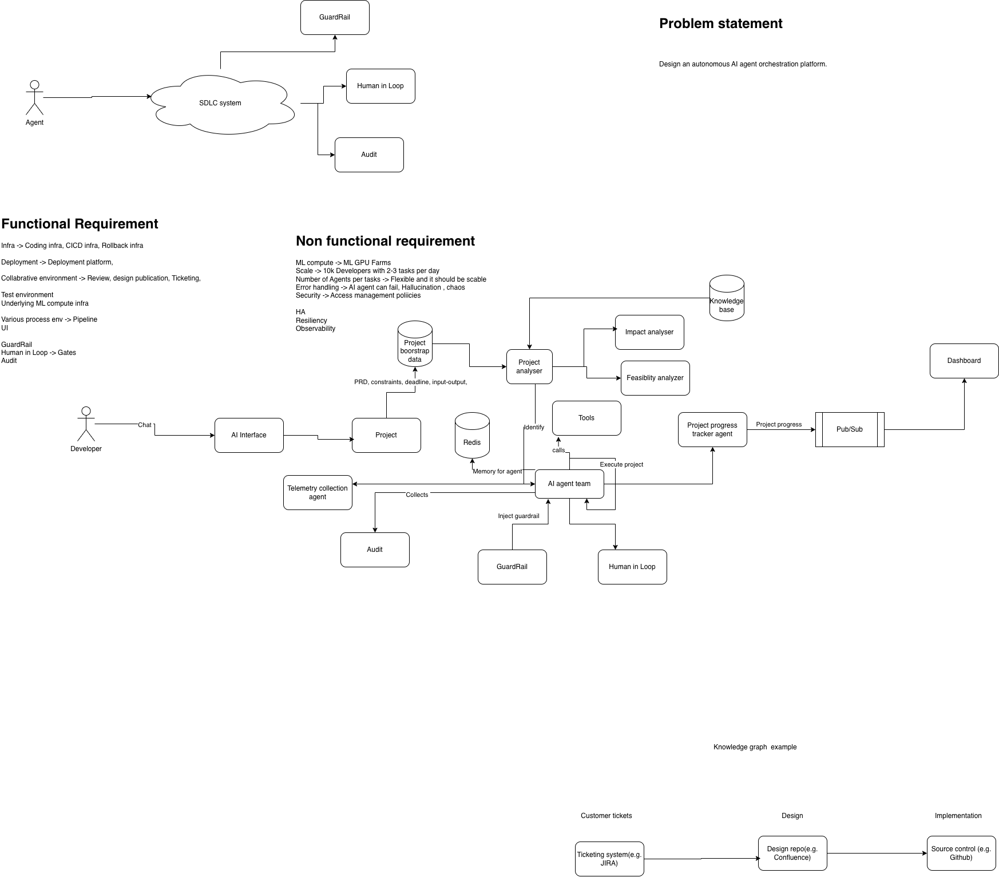

# Problem Statement: Enterprise Autonomous Agent Orchestration Platform

## 1. Executive Summary
Modern engineering organizations face significant friction in routine SDLC tasks—including impact analysis, boilerplate implementation, boundary-case test generation, and pull request audits. While generative AI models can produce isolated code snippets, unconstrained LLMs pose severe operational risks: hallucinations, security vulnerabilities, destructive terminal execution, and lack of reproducible state tracking.

This project delivers a containerized, hybrid agent orchestration platform designed to autonomously execute SDLC tasks while maintaining data sovereignty, deterministic state auditing, and strict security guardrails.

---

## 2. Core Problem & Engineering Challenges

1. **Unconstrained Code Generation:**
   - LLMs lack awareness of existing architectural patterns, often introducing incompatible changes or breaking dependencies.
2. **Security & Sandboxing Risks:**
   - Autonomous agents executing shell commands or writing arbitrary files can accidentally trigger system-level corruption (`rm -rf`, fork bombs, unauthorized socket/network exfiltration).
3. **Hardware Constraints:**
   - Running full-parameter LLMs locally requires enterprise-grade GPUs that are infeasible on standard developer hardware.
4. **State Fragmentation & Non-Determinism:**
   - Multi-agent coordination requires real-time telemetry, idempotent state inspection, and reliable event broadcasting across agent stages.

---

## 3. Architecture & Functional Objectives

The platform addresses these challenges through a three-tier hybrid design:

* **Remote Intelligence Layer:** Offloads heavy model reasoning and tool-calling decisions to high-throughput inference endpoints (Hermes 3 / Llama 3.1 8B fine-tuned).
* **Local Security & Guardrail Boundary:** Enforces Abstract Syntax Tree (AST) validation and command blocklists before any tool executes on disk.
* **Autonomous Agent Pipeline:**
  1. **Impact Analyser:** Assesses repository dependencies, calculates blast radius, and defines an execution plan.
  2. **SWE Coder:** Generates clean, modular code and accompanying unit tests within an isolated workspace.
  3. **Verification Reviewer:** Inspects generated artifacts against compliance rules, static linters, and test assertions, issuing an explicit approval verdict (`APPROVED` / `REJECTED`).
* **Telemetry & State Engine:** Utilizes Redis for event-driven Pub/Sub streaming and decoupled audit trails.

---

## 4. Non-Functional Requirements (NFRs)

* **Security:** Complete isolation of the workspace directory. Zero allowance for unsafe shell execution or unauthorized system module imports (`os`, `subprocess`, `socket`).
* **Resource Efficiency:** Designed to run local control logic and sandboxes smoothly within an 8 GB RAM / dual-core compute envelope.
* **Extensibility:** Role profiles and operational guardrails decoupled from core loop logic via modular Markdown profiles and typed configuration schemas.
* **Observability:** Granular lifecycle transitions (`STARTED`, `INVOKING`, `RETURNED`, `COMPLETED`, `BLOCKED`) published across the event bus for real-time monitoring.